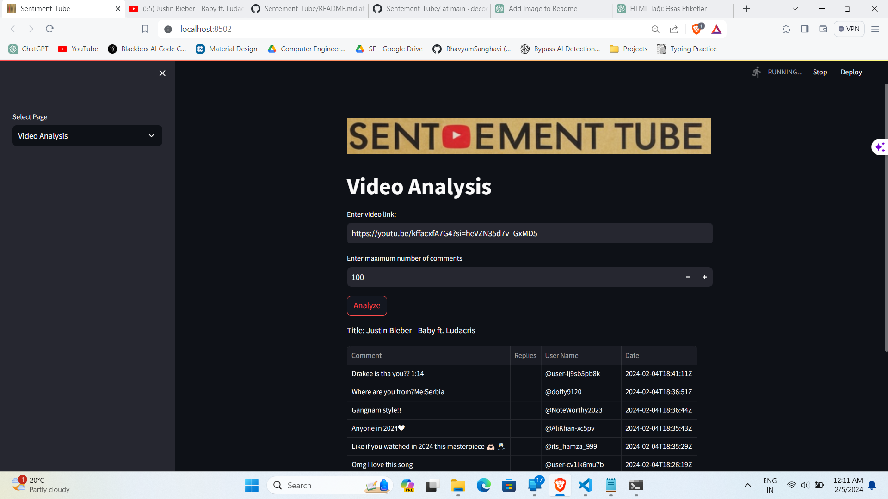

## Sentement-Tube
<h3>Understanding Audience Feedback Effectively</h3>

Our goal is to empower content consumers and creators through sentiment analysis, providing valuable insights into the emotional tone of their content. Through sentiment analysis, we aim to bridge the gap between creators and consumers, fostering meaningful connections and elevating the overall content experience.

## Key Features

- *Exclusive Focus*: Tailored for YouTube comments, our tool eliminates the need for image and video filtering.
- *Relevance Assurance*: Extracting comments from topic-related videos ensures precise sentiment analysis.
- *Topic Flexibility*: Accommodates specific requests while offering real-time analysis on any given topic.
- *Real-time Responsiveness*: Equipped for immediate sentiment analysis, enhancing adaptability.
- *Labelled Data Creation*: Effortless labeled data generation for enhanced model training and accuracy.
- *Pertinent Data Extraction*: Ensures our model receives only relevant information by extracting comments from related videos.
- *Data Visualization*: Data can be visualized in various graphs, pie charts, and diagrams according to specific needs.

## Technologies Used

- TensorFlow
- Streamlit
- Pandas
- Torch
- Matplotlib
- Google API Python Client
- Transformers
- Wordcloud

## Installation

1. Clone the repository:

    ```bash
    $ git clone https://github.com/decodingafterlife/Sentement-Tube.git
    $ cd your-repo
   ```
    
3. Install dependencies:

    ```bash
    $ pip install -r requirements.txt
    ```
    
## Usage
1. Add your youtube api key in the target_based_analysis_page.py and video_based_analysis_page.py
1. Run the application:

    ```bash
    $ streamlit run app.py
    ```
    
2. Open your browser and navigate to [http://localhost:8501](http://localhost:8501).

3. Explore sentiment analysis, visualizations, and download results using the provided options.

## Visualizations

- *Pie Charts*: Visual representation of sentiment distribution.
- *Word Clouds*: Graphical representation of frequently occurring words in positive, negative, and neutral comments.


## Download Results

Click the "Download Results" button to save sentiment analysis results in CSV format.

## Website Insights





